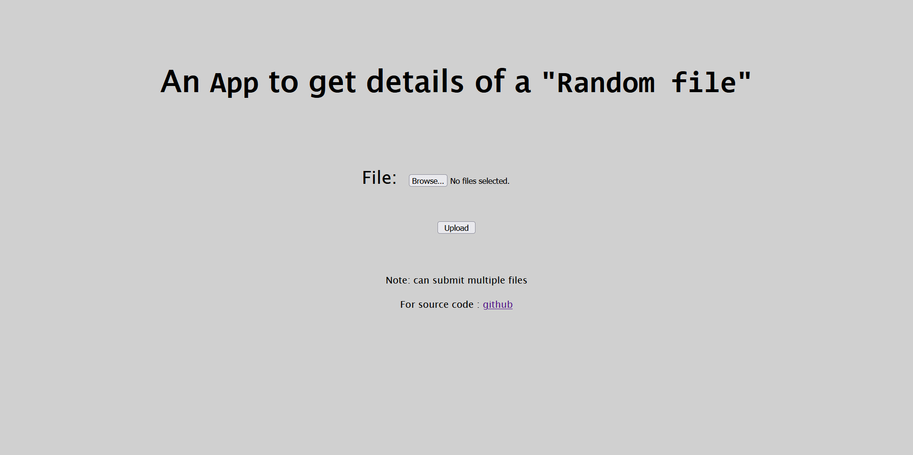
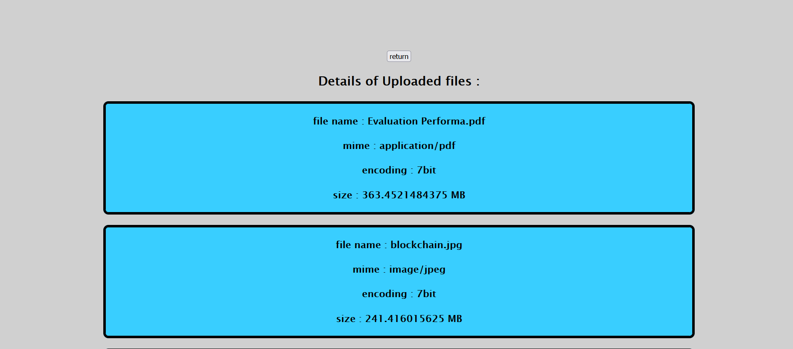

"# rapidfort_api" 
https://rapidfortapi.onrender.com/

https://hub.docker.com/repository/docker/abhishek11724/rapidfort_api/general

# File detail fetcher 

Welcome to the repository! This repository contains the source code and deployment configurations for the file detail fetcher application.

## Deployed App

The app is deployed and accessible at: [https://rapidfortapi.onrender.com/](https://rapidfortapi.onrender.com/)

## Docker Image

You can find the Docker image for the app on Docker Hub: [abhishek11724/rapidfort_api](https://hub.docker.com/repository/docker/abhishek11724/rapidfort_api/general)

## Documentation

The app is pretty basic:
### file structure
- app.js
-index.html
- deployment.yml
- Dockerfile
- package.json
- package-lock.json
- README.md
- service.yml
- .github
  - workflows
    - main.yml

### details regarding files: 
- app.js : this file contains all the main logic of the app. GET and POST request is defined here.  
    - GET request returns a index.html which is the landing page and contains a form to submit files.  
    - POST request get the files and return the details of the file in the form of a web page.

- deployment.yml and service.yml : these file are there to deploy the docker image directly to the kubernetes.

- .github/workflows/main.yml and Dockerfile : these files create a deployment pipeline for the creating a docker container.

## images 

### Endpoints

The RapidFort API provides the following endpoints:

- `GET /`: Returns a landing page for the app to upload files.
- `POST /`: Fetches data related to the files uploaded (in form of a web page).

### Usage

To interact with the API, you can use tools like `curl` or Postman. Here are a few examples:

